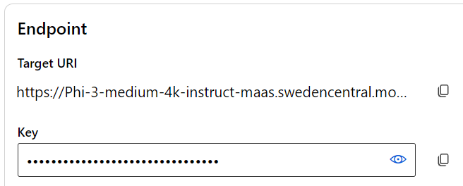

# Azure AI Inference Connector BugBash

## Setup Steps

### 1. Configuring Credentials for Concepts

Back to your Terminal, go to `repo/dotnet/samples/Concepts` folder

Access Azure AI Studio Deployment details to get the credential values



And setup the user secrets as below:

```powershell
dotnet user-secrets set "AzureAIInference:Endpoint" " ... your target Uri ... "
dotnet user-secrets set "AzureAIInference:ApiKey" "... your api key ... "
```

This configuration will be used by the Concepts project for testing.

### 2. Targets for Testing

Currently Ollama has 5 Concept tests.

- Chat / [AzureAIInference_ChatCompletion](https://github.com/microsoft/semantic-kernel/blob/feature-connectors-azureaiinference/dotnet/samples/Concepts/ChatCompletion/AzureAIInference_ChatCompletion.cs)
- Chat / [AzureAIInference_ChatCompletionStreaming](https://github.com/microsoft/semantic-kernel/blob/feature-connectors-azureaiinference/dotnet/samples/Concepts/ChatCompletion/AzureAIInference_ChatCompletionStreaming.cs)

### 3. Configuring Credentials for AI Model Router Sample

Back to your Terminal, go to `repo/dotnet/samples/Demos/AIModelRouter` folder

And setup the user secrets as below:

```powershell
dotnet user-secrets set "AzureAIInference:Endpoint" " ... your target Uri ... "
dotnet user-secrets set "AzureAIInference:ApiKey" "... your api key ... "
dotnet user-secrets set "OpenAI:ApiKey" "... your OpenAI key ... "
```
### 4. Running the sample

After configuring the sample, to build and run the console application.

### Example of a conversation

> **User** > OpenAI, what is Jupiter? Keep it simple.

> **Assistant** > Sure! Jupiter is the largest planet in our solar system. It's a gas giant, mostly made of hydrogen and helium, and it has a lot of storms, including the famous Great Red Spot. Jupiter also has at least 79 moons.

> **User** > AzureAI, what is Jupiter? Keep it simple.

> **Assistant** > Jupiter is a giant planet in our solar system known for being the largest and most massive, famous for its spectacled clouds and dozens of moons including Ganymede which is bigger than Earth!

> **User** > LMStudio, what is Jupiter? Keep it simple.

> **Assistant** > Jupiter is the fifth planet from the Sun in our Solar System and one of its gas giants alongside Saturn, Uranus, and Neptune. It's famous for having a massive storm called the Great Red Spot that has been raging for hundreds of years.