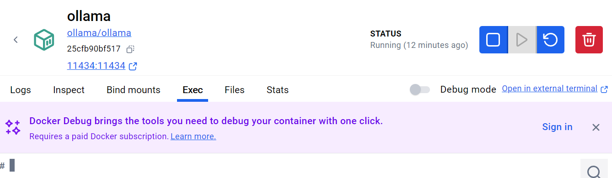

# Ollama Connector BugBash

## Setup Steps

### 1. Install Docker Desktop

If you don't have installed recommend download and install Docker Desktop on your setup, following all the intallation wizards.

### 2. Initialize Ollama Container

Access the Command Prompt and run one of the following command lines.

Nvidia GPU
```powershell
docker run -d --gpus=all -v "c:\temp\ollama:/root/.ollama" -p 11434:11434 --name ollama ollama/ollama
```
CPU only
```powershell
docker run -d -v "c:\temp\ollama:/root/.ollama" -p 11434:11434 --name ollama ollama/ollama
```

### 3. Pulling the Models for testing

Now that the container is running, lets access it and ask Ollama to pull the Local Models for the bugbash.

Open the Running Container in the Docker Desktop UI, and open the TAB `Exec`.



On this Tab another command line interface will be ready to use.

Execute the following commands:

Pulls the Phi-3 Local Model

```powershell
ollama pull phi3
```

Pulls the Mxbai Text Embedding Model
```powershell
ollama pull mxbai-embed-large
```

### 4. Configuring Credentials

Change your current branch to the feature branch [feature-connectors-ollama](https://github.com/microsoft/semantic-kernel/tree/feature-connectors-ollama)

```powershell
git pull feature-connectors-ollama
```

Back to your Terminal, go to `repo/dotnet/samples/Concepts` folder

And setup the user secrets as below:

```powershell
dotnet user-secrets set "Ollama:ModelId" "phi3"
dotnet user-secrets set "Ollama:EmbeddingModelId" "mxbai-embed-large"
```

This configuration will be used by the Concepts project for testing.

### 5. Targets for Testing

Currently Ollama has 5 Concept tests.

- Chat / [Ollama_ChatCompletion](https://github.com/microsoft/semantic-kernel/blob/feature-connectors-ollama/dotnet/samples/Concepts/ChatCompletion/Ollama_ChatCompletion.cs)
- Chat / [Ollama_ChatCompletionStreaming](https://github.com/microsoft/semantic-kernel/blob/feature-connectors-ollama/dotnet/samples/Concepts/ChatCompletion/Google_GeminiChatCompletionStreaming.cs)
- Text / [Ollama_TextGeneration](https://github.com/microsoft/semantic-kernel/blob/feature-connectors-ollama/dotnet/samples/Concepts/TextGeneration/Ollama_TextGeneration.cs)
- Text / [Ollama_TextGenerationStreaming](https://github.com/microsoft/semantic-kernel/blob/feature-connectors-ollama/dotnet/samples/Concepts/TextGeneration/Ollama_TextGenerationStreaming.cs)
- Memory / [Ollama_EmbeddingGeneration](https://github.com/microsoft/semantic-kernel/blob/feature-connectors-ollama/dotnet/samples/Concepts/Memory/Ollama_EmbeddingGeneration.cs)

### 6. Configuring Credentials for AI Model Router Sample

Back to your Terminal, go to `repo/dotnet/samples/Demos/AIModelRouter` folder

And setup the user secrets as below:

```powershell

dotnet user-secrets set "Ollama:Endpoint" "" # Optional (defaults to http://localhost:11434)
dotnet user-secrets set "Ollama:ModelId" "phi3"
dotnet user-secrets set "OpenAI:ApiKey" "... your OpenAI key ... "
```
### 7. Running the sample

After configuring the sample, to build and run the console application.

### Example of a conversation

> **User** > OpenAI, what is Jupiter? Keep it simple.

> **Assistant** > Sure! Jupiter is the largest planet in our solar system. It's a gas giant, mostly made of hydrogen and helium, and it has a lot of storms, including the famous Great Red Spot. Jupiter also has at least 79 moons.

> **User** > Ollama, what is Jupiter? Keep it simple.

> **Assistant** > Jupiter is a giant planet in our solar system known for being the largest and most massive, famous for its spectacled clouds and dozens of moons including Ganymede which is bigger than Earth!

### 8. Extra

If you want to test the Ollama more, try pulling other `Chat`/`Text` models from [Ollama's Library](https://ollama.com/library) and updating the configuration to them.

Or Embedding Models also listed here: [Embedding Models](https://ollama.com/search?c=embedding)

